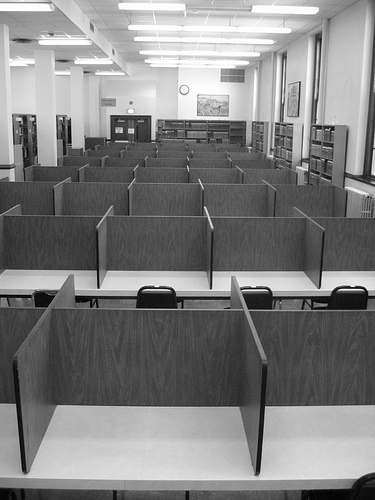
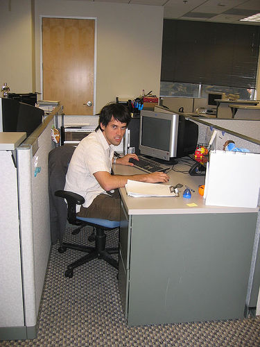

!SLIDE 

### &nbsp;
# GetSET Ruby Workshop
### &nbsp;
### Sarah Mei
### August 5th, 2009
### http://github.com/sarahmei/getset

!SLIDE

# Intro to Programming

!SLIDE

# Doing fun stuff with code

!SLIDE

## Agenda
<dd>
   <table>
   <tr><td><h3>1. Introductions</h3></td></tr>
   <tr><td><h3>&nbsp;</h3></td></tr>
   <tr><td><h3>&nbsp;</h3></td></tr>
   </table>
</dd>

!SLIDE

## Agenda
<dd>
   <table>
   <tr><td><h3>1. Introductions</h3></td></tr>
   <tr><td><h3>2. Programming basics</h3></td></tr>
   <tr><td><h3>&nbsp;</h3></td></tr>
   </table>
</dd>

!SLIDE

## Agenda
<dd>
   <table>
   <tr><td><h3>1. Introductions</h3></td></tr>
   <tr><td><h3>2. Programming basics</h3></td></tr>
   <tr><td><h3>3. Write some code!</h3></td></tr>
   </table>
</dd>

!SLIDE

## Instructors
* **Sarah Mei**
* **Wendy Peikes**
* **Juanita Mah**

!SLIDE

## You
Your name, your dream job, and your favorite whatever.

!SLIDE

## Programming.

!SLIDE centereverything

!SLIDE centereverything

!SLIDE centereverything

!SLIDE centereverything

!SLIDE 

!SLIDE 

<table>
<tr><td></td></tr>
<tr><td></td></tr>
</table>

!SLIDE centereverything

<table>
<tr><td></td></tr>
<tr><td valign="center" align="center">Requires</td></tr>
<tr><td></td></tr>
</table>

!SLIDE centereverything

<table>
<tr><td>Your program</td></tr>
<tr><td valign="center" align="center">Requires</td></tr>
<tr><td></td></tr>
<tr><td valign="center" align="center">Requires</td></tr>
<tr><td></td></tr>
</table>

!SLIDE centereverything

<table>
<tr>
<td><table border="1"><tr><td>Your program</td></tr></table></td>
<td></td>
</tr>
<tr>
<td valign="center" align="center">Requires</td>
<td>&nbsp;</td>
</tr>
<tr>
<td></td>
<td>&nbsp;</td>
</tr>
<tr>
<td valign="center" align="center">Requires</td>
<td>&nbsp;</td>
</tr>
<tr>
<td></td>
<td>&nbsp;</td>
</tr>
</table>

!SLIDE centereverything

!SLIDE

## Thank you!
## &nbsp;
#### Have a great rest of the week!
#### Slides and sample code:
#### http://github.com/sarahmei/getset

!SLIDE
 
Photo credits: Yukihiro Matsumoto, <code>_</code>why the lucky stiff, Flickr users macwagen, yuan2003, redteam, Akash k, and Shawn Econo, and Microsoft.

