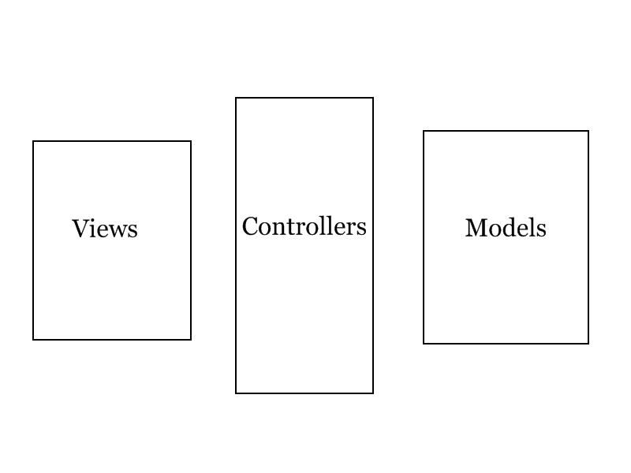

!SLIDE 

# GetSET Ruby Workshop
### Sarah Mei
### August 5th, 2009
### http://github.com/sarahmei/getset

!SLIDE

Doing fun stuff with code

!SLIDE

What is a program?

!SLIDE 

<table><tr><td valign="center">

</td><td valign="center">

</td><td valign="center">

</td></tr></table>

!SLIDE

 

 

!SLIDE centereverything

!SLIDE

How do I write one?

!SLIDE

* Learn about customer's requirements
* Translate to "stories"
* Pick a story that seems doable
* Write code that does it
* Show your work to the customer, get feedback
* Based on feedback, adjust your stories
* When a story is done, go back to "pick a story"
* Repeat until app is finished!

!SLIDE

## Let's start writing code!

!SLIDE

<table width="100%"><tr><td width="50%" align="center">

</td><td width="50%" align="center">

</td></tr><tr><td align="center">
Windows
</td><td align="center">
Mac OS X
</td></tr></table>

!SLIDE centereverything

<pre><code>
irb
</code></pre>

!SLIDE

## Variables
### words that hold information

<pre><code>
> my_variable = 5
=> 5
> my_other_variable = "hi"
=> "hi"
</code></pre>

!SLIDE

## Types of information

### text, numbers...collections?

<pre><code>
> fruits = ["kiwi", "strawberry", "plum"]
=> ["kiwi", "strawberry", "plum"]
> states = {"CA" => "California", "DE" => "Delaware"}
=> {"DE"=>"Delaware", "CA"=>"California"}
</code></pre>

!SLIDE

## Operators

### doing stuff with variables

<pre><code>
> my_variable + 2
=> 7
> my_variable * 3
=> 15
> my_fruits = my_fruits + ["lychee"]
=> ["kiwi", "strawberry", "plum", "lychee"]
> my_fruits = my_fruits - ["lychee"]
=> ["kiwi", "strawberry", "plum"]
</code></pre>

!SLIDE

## Loops

### doing the same thing a bunch of times

<table><tr><td width="37%" valign="top">
<code><b>
> puts fruits[0] 
kiwi 
=> nil 
> puts fruits[1] 
strawberry 
=> nil 
> puts fruits[2] 
plum 
=> nil
</b></code>
</td>
<td width="6%">VS</td>
<td width="57%" valign="top">
<code><b>
> fruits.each do |f| 
*   puts f 
> end 
kiwi 
strawberry 
plum 
=> ["kiwi", "strawberry", "plum"]
</b></code>
</td></tr></table>

!SLIDE

## Conditionals

### doing something only if a condition is met

<pre><code>
> fruits.each do |f|
*   puts f if f == "plum"
> end
plum
=> ["kiwi", "strawberry", "plum"]
</code></pre>

!SLIDE

## Now we've done some Ruby...
## ...let's do some Rails!

!SLIDE centereverything

!SLIDE centereverything

